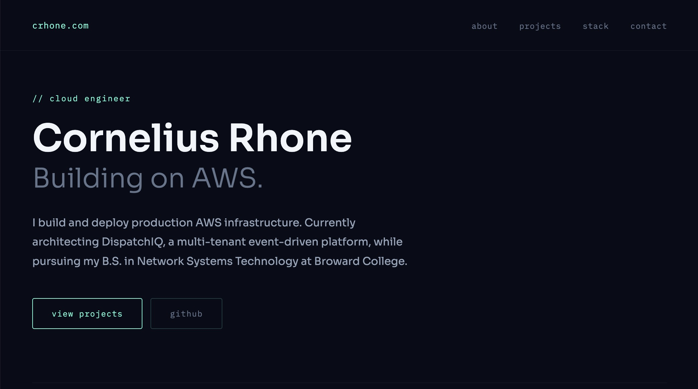
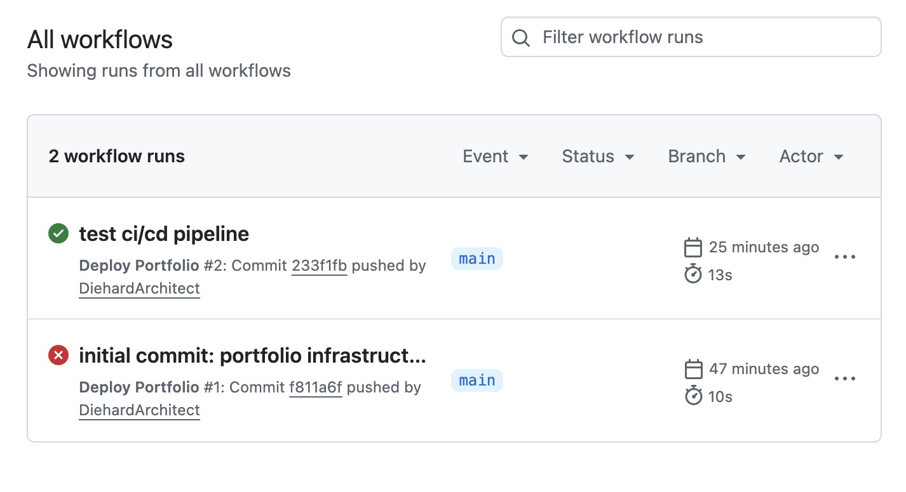
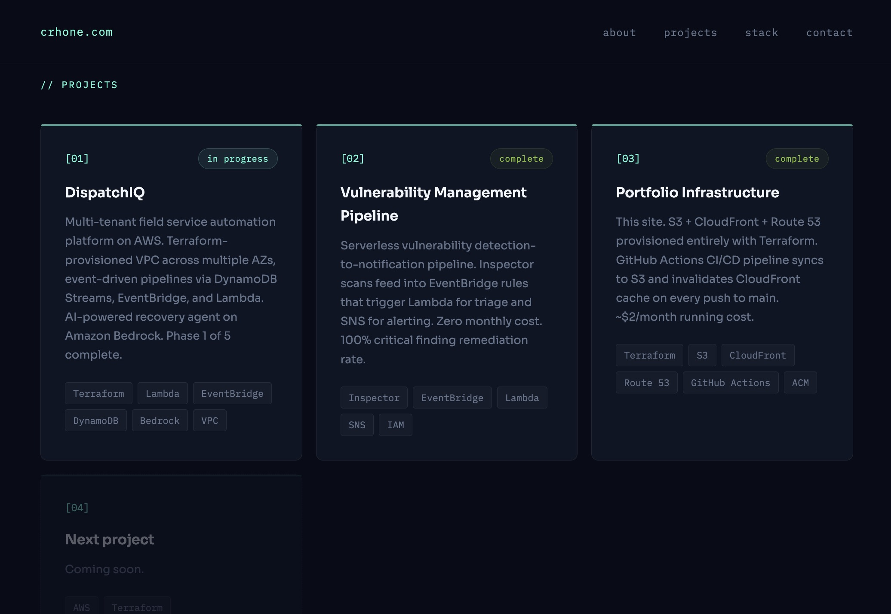
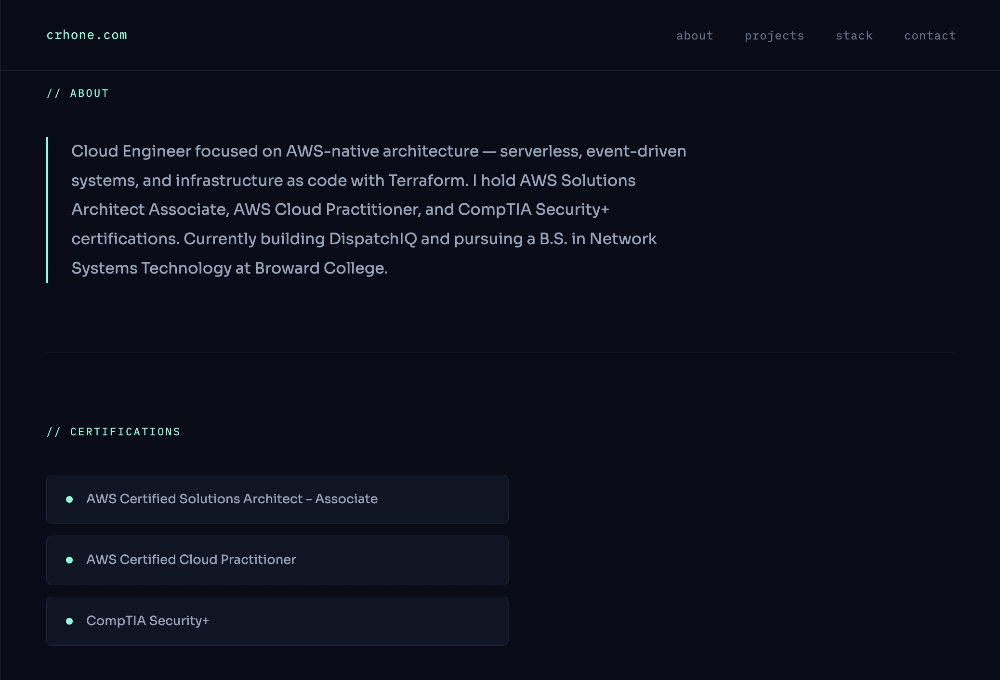

# portfolio-infrastructure

Personal portfolio site for [crhone.com](https://crhone.com) — provisioned entirely with Terraform on AWS. Push to `main` deploys automatically via GitHub Actions.



---

## Architecture
```
Browser → Route 53 (DNS) → CloudFront (CDN + HTTPS) → S3 (static files)
```
```
GitHub push to main → GitHub Actions → S3 sync → CloudFront invalidation → live in ~13s
```

---

## AWS Services

| Service | Purpose |
|---|---|
| S3 | Stores static site files — private, CloudFront-only access |
| CloudFront | CDN — serves site globally over HTTPS with caching |
| ACM | Free SSL certificate — auto-renews via DNS validation |
| Route 53 | Hosted zone + DNS records for crhone.com and www.crhone.com |

---

## Infrastructure as Code

All 13 AWS resources provisioned with Terraform:
```
portfolio-infrastructure/
├── main.tf           # AWS provider (us-east-1)
├── variables.tf      # Domain name input variable
├── s3.tf             # Private S3 bucket + OAC policy
├── cloudfront.tf     # CloudFront distribution + OAC
├── acm.tf            # SSL certificate + DNS validation
├── route53.tf        # Hosted zone + A records
└── outputs.tf        # CloudFront ID, bucket name, nameservers
```

---

## CI/CD Pipeline

GitHub Actions workflow triggers on every push to `main`:

1. Checkout code
2. Authenticate to AWS via repository secrets
3. Sync `./site` to S3 with cache-control headers
4. Invalidate CloudFront cache — changes live in under 60 seconds



---

## Deploy

**Prerequisites:**
- Terraform >= 1.0
- AWS CLI configured
- IAM user with S3, CloudFront, ACM, Route 53 permissions
```bash
git clone https://github.com/DiehardArchitect/portfolio-infrastructure.git
cd portfolio-infrastructure
cp terraform.tfvars.example terraform.tfvars
# edit terraform.tfvars → domain_name = "yourdomain.com"
terraform init
terraform plan
terraform apply
```

**GitHub Actions secrets required:**
```
AWS_ACCESS_KEY_ID
AWS_SECRET_ACCESS_KEY
S3_BUCKET_NAME
CLOUDFRONT_DISTRIBUTION_ID
```

---

## Cost

| Resource | Cost |
|---|---|
| S3 | ~$0.01/month |
| CloudFront | ~$0.01/month |
| Route 53 | $0.50/month |
| ACM | Free |
| **Total** | **~$2/month** |

---

## Site




---

## Stack

Terraform · AWS S3 · CloudFront · Route 53 · ACM · GitHub Actions

---

## Connect

- [crhone.com](https://crhone.com)
- [LinkedIn](https://www.linkedin.com/in/corneliusrhone)
- [GitHub](https://github.com/DiehardArchitect)
